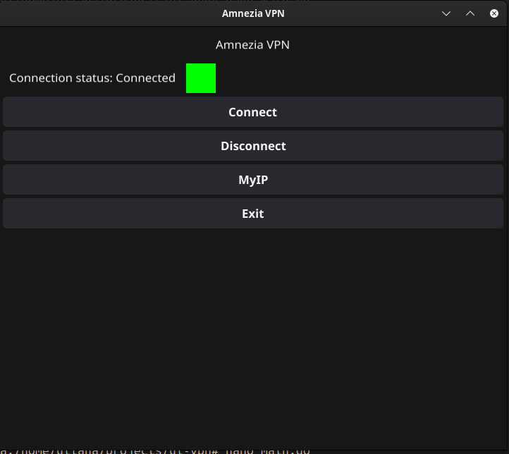

# Amnezia VPN UI

Graphical application for managing VPN connections via WireGuard (`awg-quick`). It allows you to connect and disconnect from a VPN, as well as display the current IP address.

---

## Requirements

To run the application, you need to install the following packages:

1. **WireGuard**:
   - The `awg-quick` utility for managing VPN connections.
   - Installation:
     ```bash
     sudo apt install wireguard-tools  # For Debian/Ubuntu
     ```

2. **Go** [Go install](https://go.dev/wiki/Ubuntu):
   - Installation:
     ```bash
     go version
     ```

3. **Fyne** (GUI library for Go) [Install fyne](https://github.com/fyne-io/fyne?ysclid=m8azvsbpbt343845626):
   - Installation:
     ```bash
     fyne version
     ```
## Desktop Entry

To create a desktop entry for the application, follow these steps:

1. **Create a `.desktop` file**:
   - Create a file named `amnezia-vpn.desktop` in `~/.local/share/applications/` with the following content:
     ```ini
     [Desktop Entry]
     Version=1.0
     Type=Application
     Name=AmneziaWG
     Comment=AmneziaWG UI
     Exec=sudo -i sh -c "env CONF_PATH=/path/to/config ICON_PATH=/path/to/image /path/to/main"
     Icon=/path/to/image
     Terminal=true
     Categories=Network;
     ```
   - Replace the following placeholders with actual paths:
     - `/path/to/config` — Path to your WireGuard configuration file.
     - `/path/to/image` — Path to your application icon.
     - `/path/to/main` — Path to the compiled binary of your application.

2. **Make the `.desktop` file executable**:
   - Ensure the `.desktop` file has the correct permissions:
     ```bash
     chmod +x ~/.local/share/applications/amnezia-vpn.desktop
     ```

3. **Update the desktop database**:
   - Update the desktop entry database to apply changes:
     ```bash
     update-desktop-database ~/.local/share/applications/
     ```

## Screenshots

Screenshot of the Amnezia VPN UI:


### Connection Status



---

## Installation and Launch

1. **Clone the repository**:
   ```bash
   git clone https://github.com/Liloika/AmneziaWG-ui.git
